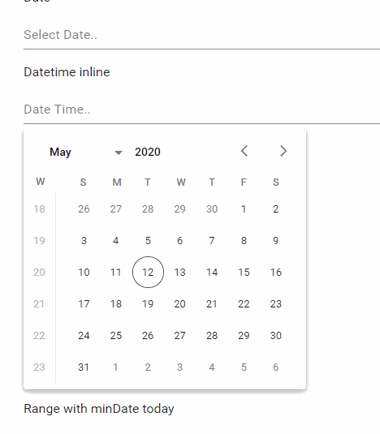

# Material design theme for flatpickr v4

[Flatpickr](https://github.com/flatpickr/flatpickr) is an awesome inline date picker.

I did a material skin to reproduce latest [Material design studies](https://material.io/components/pickers).

It fits perfectly into my [Material UI theme for Bootstrap 4](https://djibe.github.io/material/).

## Demo



You can play with my [Flatpickr fiddle](https://jsfiddle.net/djibe89/xn153qdg/) here.

## How to use

Download CSS file from this repository.

Add my flatpickr theme in your `head`.

```html
<link href="flatpickr-material-design-theme.css" rel="stylesheet">
```

Add flatpickr JavaScript before your `body` closing tag.

```html
<script src="https://cdn.jsdelivr.net/npm/flatpickr"></script>
```

Declare a simple input.

```html
<div class="form-group">
  <input class="form-control flatpickr" type="text" placeholder="Select Date.." readonly id="inline">
</div>
```

Initialize your picker.

```javascript
$("#inline").flatpickr({
  inline: false,
  mode: "single"
});
```
